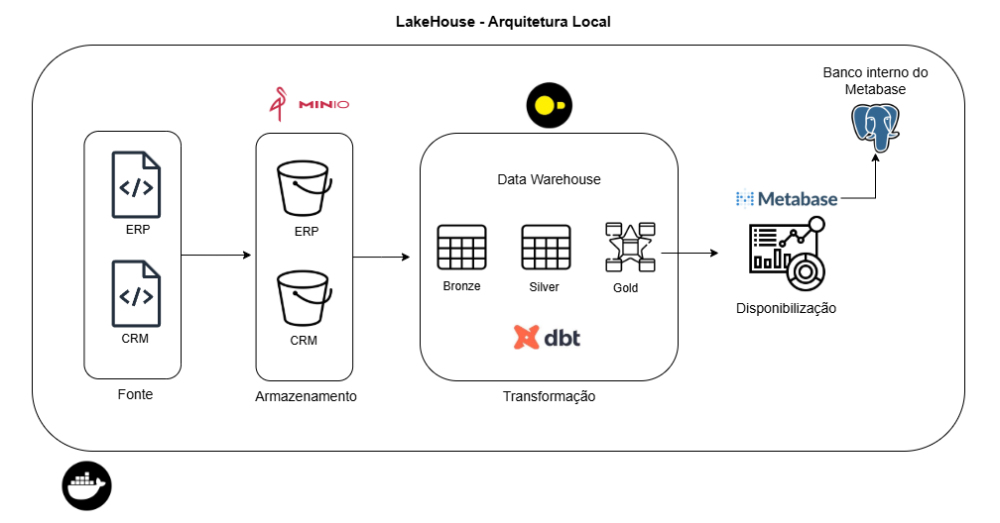

# Data Lakehouse Moderno
Este projeto demonstra um pipeline ELT em um Data Lakehouse moderno local explorando boas práticas de engenharia de dados e ferramentas open source.
# Arquitetura Local

- MinIO → utilizado como storage simulando o papel de um Data Lake.

- DuckDB → atua como data warehouse local e motor de processamento SQL.

- dbt → responsável por direcionar a transformação dos dados seguindo a arquitetura medalhão em camadas (camadas Bronze → Silver → Gold).

- Metabase → ferramenta de self-service BI, possibilitando a exploração e visualização dos dados refinados.

- 

## Como executar  

### Pré-requisitos  
- [Docker](https://docs.docker.com/get-docker/)  
- [Docker Compose](https://docs.docker.com/compose/install/)  

### Passos  
1. Clone este repositório:

   ```
   git clone https://github.com/vinitg96/elt-data-lakehouse.git
   cd elt-data-lakehouse
2. Suba os serviços com o Docker Compose:
    ```
    docker compose up
3. Acesse as aplicações:
- Metabase: http://localhost:8080
- MinIO Console: http://localhost:9001
\
<br>

# Próximos Passos
- Implementar testes e documentação dos modelos SQL com o dbt

- Migrar arquitetura para nuvem usando os seguintes serviços:
    - S3 como storage (lake)
    - Motherduck: substitui o duckDB como warehouse eliminando o problema da concorrencia
    - EC2 para subir a aplicação final com o metabase e o worflow do dbt
    - RDS como banco de aplicação do metabse, garantindo a persistencia