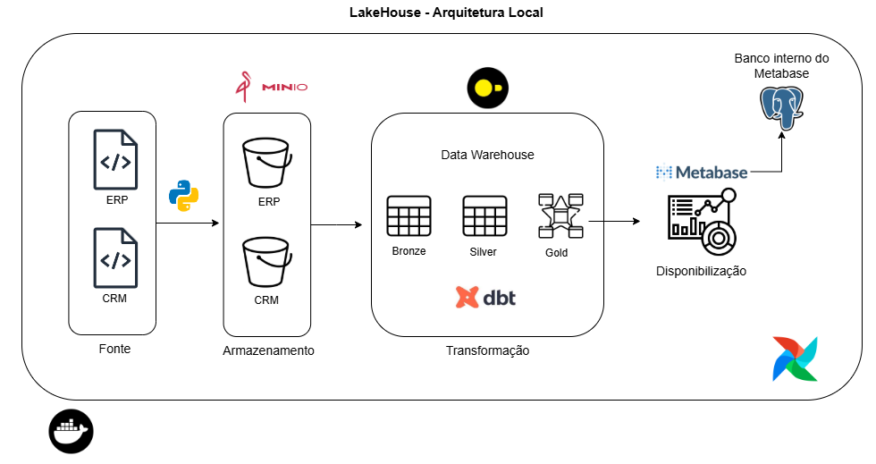
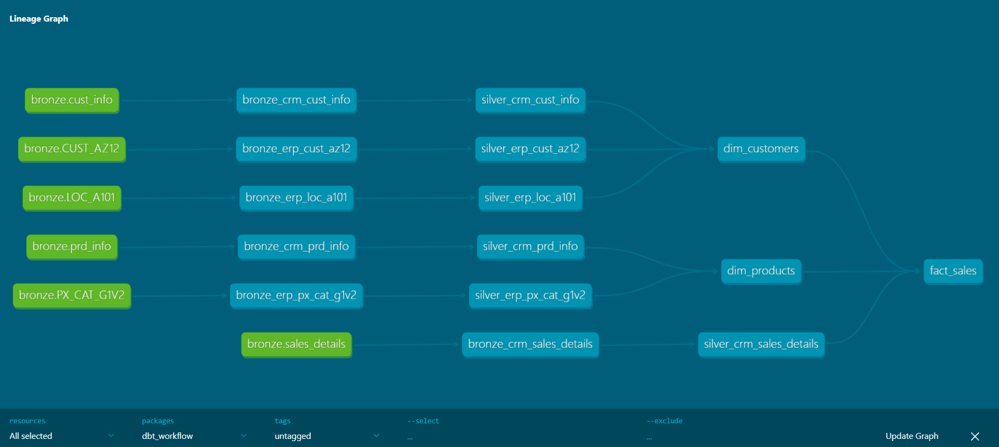
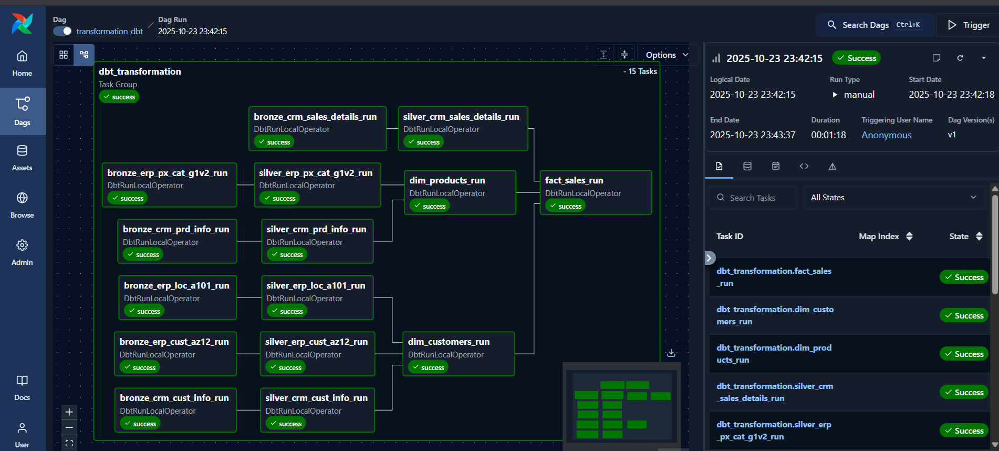
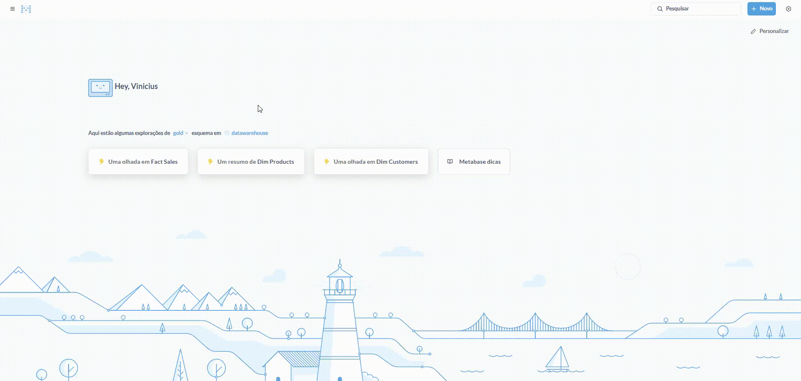

# Data Lakehouse Moderno



Este projeto simula um ambiente moderno de Data Lakehouse em execução local, permitindo estudar conceitos de ingestão, transformação (dbt), orquestração (Airflow) e visualização (Metabase).

A stack é ideal para cenários de dados estáticos (sem necessidade de ingestão incremental) ou para a criação de provas de conceito (POCs) voltadas à exploração e análise de dados, antes de uma eventual migração para a nuvem.

O pipeline segue a abordagem ELT (Extract, Load, Transform), onde:
1. Os dados são extraídos das fontes (ERP e CRM) em formato csv e carregados no Lake (armazenado no MinIO) via script Python;

2. O DuckDB atua como data warehouse local, conectando-se diretamente aos arquivos no Lake para consulta e processamento;

3. O dbt direciona as transformações, utilizando a engine do warehouse (DuckDB) para processar as queries SQL. As transformações seguem a arquitetura em camadas: Bronze → Silver → Gold, garantindo rastreabilidade, qualidade e organização dos dados.


# Contexto
A empresa de e-commerce tem como objetivo integrar dados provenientes de duas origens distintas (CRM e ERP) para construir uma visualização unificada que consolide informações comerciais e operacionais.

O sistema CRM concentra os dados relacionados a clientes, produtos e vendas, refletindo as interações comerciais e o desempenho de vendas da empresa.
Já o sistema ERP armazena informações cadastrais complementares sobre clientes (como data de nascimento e gênero), dados geográficos e a estrutura hierárquica de categorias e subcategorias de produtos, que servem como base para análises de portfólio e segmentação de mercado.

Essa integração visa enriquecer as análises de desempenho e comportamento do cliente, possibilitando uma visão 360° do negócio e apoiando a tomada de decisão estratégica.

# Arquitetura Local

- **MinIO**: Camada de armazenamento de objetos, simulando um Data Lake.  

- **DuckDB**: Atua como um Data Warehouse local sendo responsável por processar as consultas SQL.

- **dbt**: Responsável por gerenciar a transformação dos dados seguindo a arquitetura medalhão ilustrada abaixo.  
  - **Bronze**: dados brutos, sem alterações e sem inferência de tipos.  
  - **Silver**: dados limpos e padronizados; valores inconsistentes corrigidos, datas e tipos ajustados, códigos e categorias normalizados.  
  - **Gold**: dados agregados e refinados, voltados ao negócio. Modelos em star schema: 2 tabelas dimensões (clientes e produtos) e 1 fato (vendas).  

- 

- **Metabase**: Ferramenta de self-service BI, possibilitando a exploração e visualização dos dados refinados.

- **Airflow**: Gerencia a orquestração do pipeline.

- **Docker**: Containeriza todos os serviços, garantindo reprodutibilidade, isolamento e fácil execução do ambiente.


## Como executar  

### Pré-requisitos  
- [Docker](https://docs.docker.com/get-docker/)  
- [Docker Compose](https://docs.docker.com/compose/install/) 
- [Astronomer CLI](https://www.astronomer.io/docs/astro/cli/install-cli) 

### Passos  
1. Clone este repositório:

   ```
   git clone https://github.com/vinitg96/elt-data-lakehouse.git
   cd elt-data-lakehouse
   ```
2. Suba os serviços do MinIO, Metabase e Postgres:
    ```
    make infra
    ```
3. Suba o airflow:
    ```
    make airflow
    ````

4. Acesse o Airflow em http://localhost:8080
    - As DAGs **extract_load_minio** e **transformation_dbt** serão executadas automaticamente, com as dependências entre elas definidas pelo TriggerDagRunOperator.
    - Aguarde a conclusão da DAG **transformation_dbt**. Ao final da execução, será gerado o arquivo **dw.duckdb** no diretório **./services/dbt_workflow/datawarehouse/.**
    - Um detalhe interessante é que o pacote [Cosmos](https://github.com/astronomer/astronomer-cosmos) permite visualizar cada modelo SQL definido no dbt como uma task, conforme imagem abaixo.
     
    

5. Acesse o Metabase em http://localhost:80 
    - Na etapa 4 da criação do usuário ("Adicione seus Dados"), busque por DuckDB e no campo **"Database File"** informe o caminho **/app/datawarehouse/dw.duckdb**
    - Após a conexão ser estabelecida com sucesso, será possível interagir com as tabelas pelo Metabase, conforme demonstrado no GIF abaixo. 

   

6. O MiniIO console pode ser acessado em http://localhost:9001
    - usuario: minio123
    - senha: minio123


# Observações
- O MinIO e o banco de aplicação do Metabase (postgres) fazem usos de volumes nomeados. Dessa forma os dados, configurações, queries, dashboards, etc irão persistir mesmo com os containers sendo removidos ou desligados.
- O duckdb não permite acessos simultaneos, logo, caso queira executar a DAG **transformation_dbt**  após a configuração do metabase, é necessário desligar o container metaduck

# Próximos Passos
- Implementar testes e documentação dos modelos SQL com o dbt
- Melhorar logs
- Migrar arquitetura para nuvem usando os seguintes serviços:
    - S3 como storage (lake)
    - Motherduck: substitui o duckDB como warehouse eliminando o problema da concorrencia
    - EC2 para subir o metabase
    - RDS como banco de aplicação do metabse, garantindo a persistencia
