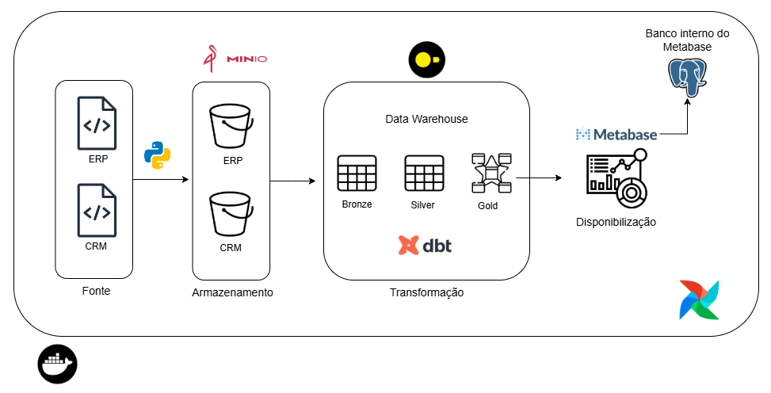
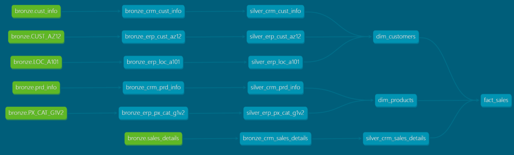
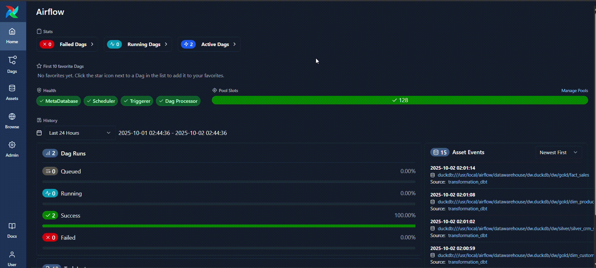
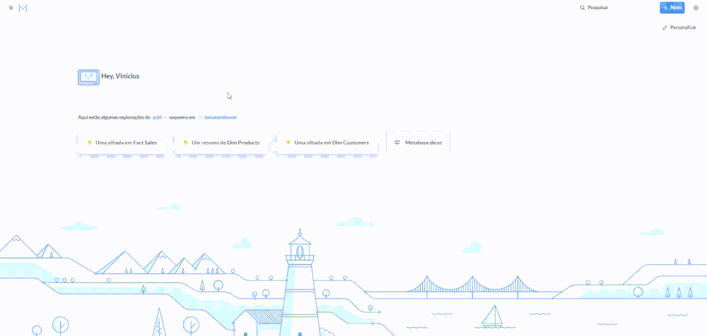

# Pipeline ELT Moderno: Data Lake + Data Warehouse



Este projeto foi construído para fins de estudo e simula localmente uma stack analítica moderna, cobrindo ingestão, transformação (dbt), orquestração (Airflow) e visualização (Metabase).

A arquitetura segue o modelo de duas camadas: um Data Lake (MinIO) armazena os dados brutos e um Data Warehouse (DuckDB) armazena os dados transformados. Ela é adequada para provas de conceito (POCs) e análises exploratórias com poucos usuários, porque o DuckDB aceita apenas um processo de escrita por vez e todo o ambiente roda em uma única máquina. Como o MinIO é compatível com a API do S3, uma futura migração para a nuvem não exige reescrever a camada de ingestão. O Airflow foi incluído para exercitar a orquestração, embora os dados de exemplo sejam estáticos.

O pipeline segue a abordagem ELT (Extract, Load, Transform):

1. Os dados das fontes (ERP e CRM, simuladas por arquivos CSV) são carregados no Data Lake (MinIO) por um script Python.
2. O DuckDB atua como Data Warehouse local. Ele lê os arquivos diretamente do Lake e armazena os modelos transformados no arquivo `dw.duckdb`.
3. O dbt orquestra as transformações e usa a engine do DuckDB para executar as queries SQL. As transformações seguem a arquitetura em camadas Bronze → Silver → Gold, o que organiza os dados e deixa rastreável cada etapa do processamento.


# Contexto
Uma empresa de e-commerce quer integrar dados de duas origens distintas (CRM e ERP) em uma visualização unificada que consolide informações comerciais e operacionais.

O CRM concentra os dados de clientes, produtos e vendas, refletindo as interações comerciais e o desempenho de vendas da empresa. O ERP armazena informações cadastrais complementares sobre os clientes (como data de nascimento e gênero), dados geográficos e a hierarquia de categorias e subcategorias de produtos. Essas informações servem de base para análises de portfólio e segmentação de mercado.

Neste projeto, as duas fontes são simuladas por arquivos CSV estáticos, disponíveis no diretório `data/`.

A integração enriquece as análises de desempenho e de comportamento do cliente, oferece uma visão 360° do negócio e apoia a tomada de decisão estratégica.

# Arquitetura Local

 - **MinIO**: armazenamento de objetos compatível com S3. Atua como Data Lake e guarda os dados brutos.
- **DuckDB**: Data Warehouse local, responsável por processar as consultas SQL e armazenar os modelos transformados no arquivo dw.duckdb.
- **dbt**: gerencia a transformação dos dados seguindo a arquitetura medalhão ilustrada abaixo.
  - **Bronze**: dados brutos, sem alterações e sem inferência de tipos.
  - **Silver**: dados limpos e padronizados, com valores inconsistentes corrigidos, datas e tipos ajustados e códigos e categorias normalizados.
  - **Gold**: dados modelados para consumo analítico em star schema, com 2 tabelas dimensão (clientes e produtos) e 1 tabela fato (vendas).



- **Metabase**: ferramenta de self-service BI para explorar e visualizar os dados da camada Gold. Roda no container `metaduck`, uma imagem customizada do Metabase que inclui o driver comunitário do DuckDB.
- **Airflow**: orquestra o pipeline. Roda via Astronomer CLI, em uma stack separada que se conecta aos demais serviços pela rede Docker `airflow_network`.
- **Docker**: containeriza todos os serviços, garantindo reprodutibilidade, isolamento e facilidade para executar o ambiente.


## Como executar  

### Pré-requisitos  
- [Docker](https://docs.docker.com/get-docker/)  
- [Docker Compose](https://docs.docker.com/compose/install/) 
- [Astronomer CLI](https://www.astronomer.io/docs/astro/cli/install-cli) 

### Passos  
1. Clone este repositório:

   ```
   git clone https://github.com/vinitg96/elt-modern-data-stack.git
   cd elt-modern-data-stack
   ```
2. Suba os serviços do MinIO, do Metabase e do Postgres. Este comando também cria a rede `airflow_network`, usada pelo Airflow, e por isso deve ser executado primeiro:
    ```
    make infra
    ```
3. Suba o Airflow:
    ```
    make airflow
    ````

4. Acesse o Airflow em <http://localhost:8080>
  - As DAGs **extract_load_minio** e **transformation_dbt** serão executadas automaticamente. A dependência entre elas é definida pelo TriggerDagRunOperator.
  - Aguarde a conclusão da DAG **transformation_dbt**. Ao final da execução, será gerado o arquivo **dw.duckdb** no diretório **./services/dbt_workflow/datawarehouse/**.
  - O pacote [Cosmos](https://github.com/astronomer/astronomer-cosmos) exibe cada modelo SQL do dbt como uma task no Airflow, conforme a imagem abaixo.



5. Acesse o Metabase em <http://localhost:80>
  - Na etapa 4 da criação do usuário ("Adicione seus Dados"), busque por DuckDB e, no campo **"Database File"**, informe o caminho **/app/datawarehouse/dw.duckdb**.
  - Depois que a conexão for estabelecida, você poderá interagir com as tabelas pelo Metabase, conforme o GIF abaixo.



6. O console do MinIO pode ser acessado em <http://localhost:9001>
  - usuário: minio123
  - senha: minio123


# Observações
- O MinIO e o banco de aplicação do Metabase (Postgres) usam volumes nomeados. Assim, dados, configurações, queries e dashboards persistem mesmo quando os containers são removidos ou desligados.
- O DuckDB aceita **um único processo com permissão de escrita** ou **vários processos somente leitura** no mesmo arquivo, mas não os dois ao mesmo tempo. Como o dbt precisa de escrita exclusiva, para executar novamente a DAG **transformation_dbt** depois de configurar o Metabase é necessário desligar o container `metaduck`.
- O Postgres do Metabase está exposto na porta `5433` do host para não conflitar com o Postgres interno do Airflow (Astronomer), que usa a porta `5432`.
- O comando `make infra` aplica `chmod 777` ao diretório `./services/dbt_workflow/datawarehouse/` para que os containers do Airflow e do Metabase possam ler e escrever o arquivo `dw.duckdb`.
- As credenciais estão definidas diretamente no `docker-compose.yml` para simplificar a execução local. **Não use essas credenciais em produção**. Nesse caso, prefira variáveis de ambiente ou um arquivo `.env`.

# Próximos Passos
- Implementar testes e documentação dos modelos SQL com o dbt, para garantir a qualidade dos dados
- Melhorar os logs
- Evoluir para uma arquitetura Lakehouse, armazenando as camadas Silver e Gold no próprio Data Lake em um formato de tabela aberto (ex.: DuckLake ou Apache Iceberg)
- Migrar a arquitetura para a nuvem usando os seguintes serviços:
  * S3 como storage (Data Lake)
  * MotherDuck no lugar do DuckDB local como warehouse, eliminando a limitação de concorrência
  * EC2 para hospedar o Metabase
  * RDS como banco de aplicação do Metabase, garantindo a persistência
