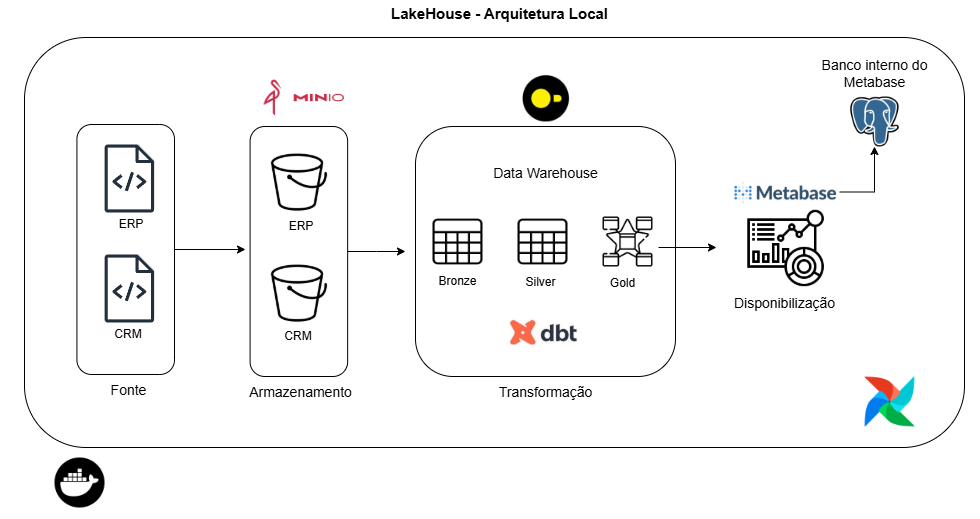

# Data Lakehouse Moderno
Este projeto demonstra um pipeline ELT em um Data Lakehouse local explorando boas práticas de engenharia de dados e ferramentas open source.
# Arquitetura Local

- MinIO → utilizado como storage simulando o papel de um Data Lake.

- DuckDB → atua como data warehouse local e motor de processamento SQL.

- dbt → responsável por direcionar a transformação dos dados seguindo a arquitetura medalhão em camadas (camadas Bronze → Silver → Gold).

- Metabase → ferramenta de self-service BI, possibilitando a exploração e visualização dos dados refinados.

- 

## Como executar  

### Pré-requisitos  
- [Docker](https://docs.docker.com/get-docker/)  
- [Docker Compose](https://docs.docker.com/compose/install/) 
- [Astronomer CLI](https://www.astronomer.io/docs/astro/cli/install-cli) 

### Passos  
1. Clone este repositório:

   ```
   git clone https://github.com/vinitg96/elt-data-lakehouse.git
   cd elt-data-lakehouse
2. Suba o airflow:
    ```
    make airflow
3. Suba os demais serviços:
    ```
    make infra
4. Execute as DAGs no airflow em http://localhost:8080
    - Execute primeiro a DAG **extract_load_minio** e depois a DAG **transformation_dbt**

5. Acesse o Metabase em http://localhost:80
    - Na seção 4 do setup inicial ("Adicione seus Dados"), busque por DuckDB e no campo **"Database File"** preencha o caminho **/app/datawarehouse/dw.duckdb**


6. O MiniIO console pode ser acessado em http://localhost:9001
    - usuario: minio123
    - senha: minio123


# Observações
- O MinIO e o banco de aplicação do Metabase (postgres) fazem usos de volumes nomeados. Dessa forma os dados, configurações, queries, dashboards, etc irão persistir mesmo com os containers sendo removidos ou desligados.
- O duckdb não permite acessos simultaneos, logo, caso queira executar a DAG **transformation_dbt** uma segunda vez, é necessário desligar o container do metabase (metaduck)

# Próximos Passos
- Implementar testes e documentação dos modelos SQL com o dbt
- Melhorar logs
- Migrar arquitetura para nuvem usando os seguintes serviços:
    - S3 como storage (lake)
    - Motherduck: substitui o duckDB como warehouse eliminando o problema da concorrencia
    - EC2 para subir a aplicação final com o metabase e o worflow do dbt
    - RDS como banco de aplicação do metabse, garantindo a persistencia
